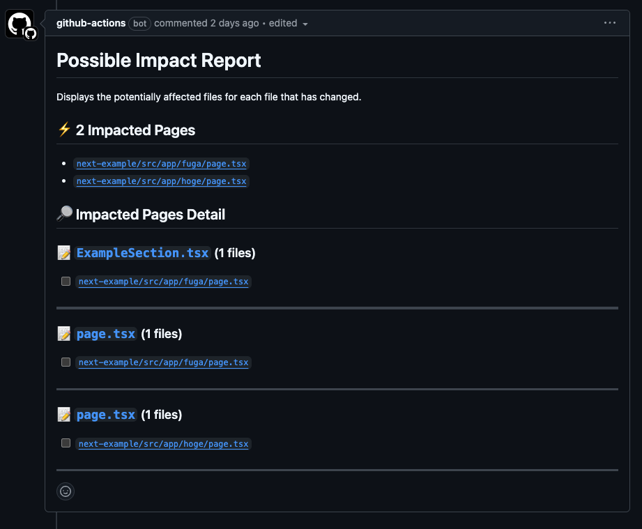

## Possible Page Impact

"Possible Page Impact" is an Action that comments which pages the PR changes may affect.

## Usage

Below is a simple example.
Matches page files (`page.tsx`) that do not include `internal`

```yaml
name: Possible Impact Report

on:
  pull_request:
    types: [opened, synchronize]

jobs:
  comment-report:
    runs-on: ubuntu-latest

    steps:
      - uses: actions/checkout@v4
      - uses: cut0/possible-page-impact@main
        with:
          app_dir: "./src"
          pages_regex: "^(?!.*\\/internal\\/).*\\/page\\.tsx$"
```

And the comment is as follows:



### Inputs

| Name          | Description                                                                                 |
| ------------- | ------------------------------------------------------------------------------------------- |
| app_dir\*     | Specify the target project. Specify the relative path from the root.                        |
| pages_regex   | Describe the page file pattern using regular expressions. (ex: `src\/pages.\*\/index\.tsx`) |
| pages_pattern | Use glob to specify page patterns. (ex: `src/pages/**/index.tsx`)                           |

## Example

Here is an example:

- [Next.js](./examples/next-example/.github/workflows/_example.yml)
- [TanStack Rotuer](./examples/tanstack-router-example/.github/workflows/_example.yml)
